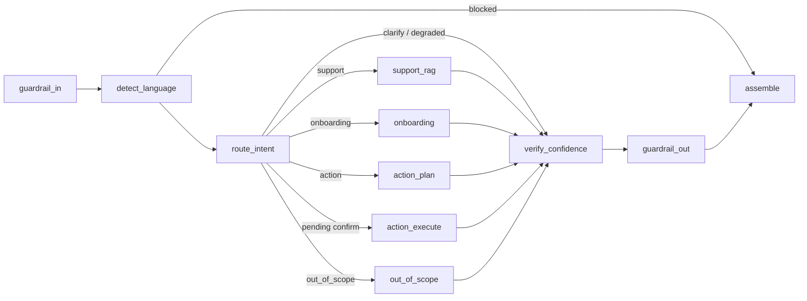

# Zapp Assist — multilingual support & onboarding agent

A production-minded, **multilingual conversational AI agent** for a Zapp-style delivery/fintech
service, built with **Spec-Driven Development (SDD)**. Every user turn is understood, routed, and
returned as a **single schema-valid JSON contract** — success, blocked, or degraded.

> Take-home assessment for the **AI Agent Engineer** position at Zapp Global.

**Status:** spec `001-support-agent` is fully implemented (US1–US5) — the orchestrated agent core
with baseline multilingual + guardrails inline. Specs `002-multilingual`, `003-guardrails`, and
`004-evaluation` deepen those cross-cutting concerns next (see [Roadmap](#roadmap)).

---

## What it does

| Capability | Behavior |
| --- | --- |
| **Grounded support** (US1) | Answers only from a curated KB (BM25 retrieval); **declines instead of inventing** when there is no grounding. |
| **Onboarding intake** (US2) | Slot-fills contact data across turns; normalizes phone → **E.164 + country** deterministically and **fuses** it with the LLM's reading. |
| **Actions with HITL** (US3) | State-changing actions (cancel/reschedule) are **restated and confirmed before executing**, exactly once. |
| **Safety envelope** (US4) | Off-topic / unsafe / prompt-injection inputs are declined transparently, in the user's language, with the decision recorded in the contract. |
| **Graceful degradation** (US5) | Any timeout / malformed output / tool error still yields a valid, safe, `needs_review=true` contract — never a crash. |
| **Multilingual** | ES / EN / PT, detected and locked per session; replies stay in the active language. |
| **Observability** | Per-turn trace: one span per node + token/latency/cost accounting. |

---

## Quickstart

**Prerequisites:** Python 3.11+, [`uv`](https://docs.astral.sh/uv/). An `ANTHROPIC_API_KEY` is only
needed to run the agent live — **the full test suite uses a mock LLM and needs no key or network.**

```bash
uv sync                       # install pinned deps (pyproject.toml / uv.lock)
cp .env.example .env          # then add ANTHROPIC_API_KEY (for live runs only)

# Run the agent (live — needs a key)
uv run zapp-assist turn --session demo --text "¿hasta cuándo puedo reprogramar mi entrega?"
uv run zapp-assist chat        # interactive multi-turn (keeps active_lang + memory)

# Verify everything (no key needed)
uv run pytest                 # 54 tests: unit + contract + integration
uv run ruff check . && uv run mypy src
```

A one-shot `turn` prints the canonical JSON contract; the expected shape is in
[`specs/001-support-agent/contracts/agent-turn.md`](specs/001-support-agent/contracts/agent-turn.md).

---

## The per-turn contract

Every turn returns exactly this object (validated by Pydantic; an invalid/incomplete result is
replaced by a safe fallback with `needs_review=true` — the system never emits a partial result):

```jsonc
{
  "reply": "…",                    // always non-empty, in active_lang
  "detected_lang": "es",           // ISO 639-1
  "active_lang": "es",             // session-locked language
  "lang_confidence": 0.94,
  "final_normalized_text": "+525512345678",   // LLM ⨉ deterministic fused
  "detected_country": "MX",        // ISO 3166-1 alpha-2 | null
  "confidence_score": 0.88,
  "needs_review": false,
  "guardrails": { "input": [], "output": [] }  // recorded decisions
}
```

---

## Architecture

An orchestrated, typed graph. Nodes are pure `(state, deps) -> state` handlers; the orchestration
engine and the model vendor are each isolated behind one seam.



**Design principles (from the [constitution](.specify/memory/constitution.md)) and how they show up:**

- **Modularity & isolation** — LangGraph lives *only* in `graph/build.py`; the Anthropic SDK lives
  *only* in `llm/anthropic_adapter.py` behind an `LLMClient` protocol. Tools and guardrails are
  registries. Swapping the orchestrator or the provider touches one file.
- **Signal fusion & deterministic safety** (Principle X) — for correctness-critical values (phone
  normalization, country, language), a deterministic library wins over the LLM; a divergence lowers
  `confidence_score` and sets `needs_review`. Action confirmation is **deterministic** — an
  irreversible operation never executes on a model's "maybe".
- **Guardrails by default, fail-safe** — input guardrails run before processing, output guardrails
  before returning, on *every* turn; a block yields a safe reply, never the blocked content.
- **Resilience** — every node is wrapped so an exception degrades the turn (records an `error` span)
  instead of crashing; `assemble` always runs and always produces a valid contract.
- **Observability** — each node emits one `Span`; tokens/cost/latency are aggregated per turn,
  which is the signal source the `004` eval suite will consume.
- **Config-as-data** — models, per-node effort, thresholds, supported languages, and pricing live in
  `config.yaml`; secrets come from the environment. No models/thresholds are hardcoded in `src`.

### Repo layout

```
src/zapp_assist/
  agent.py            # Agent.create / run_turn — the callable entry point
  contracts.py        # the canonical TurnResult (+ safe_fallback)
  config.py           # config-as-data loader (config.yaml + env)
  llm/                # LLMClient protocol + the isolated Anthropic adapter
  graph/              # build.py (LangGraph) + state.py + nodes/*
  guardrails/         # registry + baseline rules
  lang/               # lingua detector + fuse()
  rag/                # BM25 store + curated KB (12 ES/EN/PT docs)
  tools/              # registry + normalize (phonenumbers) + mock_backend
  memory/             # session store (swappable interface)
  obs/                # Trace / Span / cost accounting
specs/001-support-agent/   # spec.md, plan.md, tasks.md, research.md, data-model.md, contracts/
```

---

## Methodology: Spec-Driven Development

Developed spec-first: every feature is **specified, designed, and broken into tasks before
implementation**, each as its own feature branch merged to `main` via PR. The framework is
**[GitHub Spec Kit](https://github.com/github/spec-kit)**, driven through Claude Code skills;
artifacts live under `specs/<NNN-feature>/`.

### Spec Kit ↔ assessment file mapping

Spec Kit uses fixed artifact filenames that map 1:1 onto the brief's requested structure. We keep
Spec Kit's native names rather than editing the tool internals (upgrade-safe); this table is the
correspondence:

| Assessment deliverable | This repo (Spec Kit) | Contents |
| --- | --- | --- |
| `requirements.md` | `spec.md` | User stories, acceptance criteria, functional requirements |
| `design.md` | `plan.md` (+ `research.md`, `data-model.md`, `contracts/`) | Architecture, components, contracts, decisions |
| `tasks.md` | `tasks.md` | Verifiable, dependency-ordered implementation plan |

---

## Roadmap

001 ships baseline multilingual + guardrails *inline* (satisfying the turn-lifecycle requirements);
the remaining specs deepen each concern as its own vertical slice:

- **`002-multilingual`** — richer detection, mid-session switch policy, coherence across turns.
- **`003-guardrails`** — the full input/output guardrail taxonomy and rule set.
- **`004-evaluation`** — one-command, CI-ready eval suite: task success, language fidelity,
  guardrail precision/recall, LLM-as-judge quality, latency & cost, with a pre-generated report.

---

## Notable decisions & trade-offs

**Documented divergence — "temperature 0".** The brief suggests `temperature=0` for determinism.
Anthropic's current frontier models (`claude-sonnet-5` / `claude-opus-5`) **reject** `temperature`
(HTTP 400); only older models (e.g. `claude-haiku-4-5`) accept it. So the adapter forwards
`temperature` *only* to temperature-capable models (flagged in `config.yaml`), and determinism is
pursued structurally instead: **structured output** (`messages.parse` against Pydantic schemas), low
adaptive-thinking **effort** on routing/extraction, and **deterministic** libraries for the
correctness-critical paths (phone normalization, language detection, action confirmation).

**Other trade-offs:**

- **BM25, not embeddings** — the KB is small and curated; lexical retrieval is deterministic, offline,
  and enough to demonstrate grounding + "decline rather than hallucinate". The `BM25Store` interface
  is the documented swap-point for embeddings.
- **Mock backend** — order/account actions run against a deterministic in-memory backend (a stated
  scope decision, not a hidden gap). HITL/exactly-once semantics are real; the persistence is mocked.
- **In-memory session store** — behind a `SessionStore` protocol, swappable for Redis/DB with no
  node changes.
- **Deterministic confirmation** — action confirmation uses a yes/no lexicon (ES/EN/PT) rather than
  an LLM, deliberately: safety over cleverness for irreversible operations.

**Known limitations:**

- The live Anthropic path is exercised structurally but the shipped tests mock the LLM (no key in
  CI); a live smoke test needs `ANTHROPIC_API_KEY`.
- Guardrail rules are conservative heuristics (spec `003` replaces them with the full taxonomy).
- Language detection is tuned for ES/EN/PT; very short inputs may fall back rather than lock.

---

## Where AI-copilot suggestions were accepted / rejected

This project was built with an AI copilot (expected by the brief). Notable calls:

**Accepted:**
- The **vendor-isolation seams** (LangGraph in one file, Anthropic in one file) — accepted and
  enforced with a grep check, because they make the provider/orchestrator genuinely swappable.
- **Deterministic-wins fusion** and **deterministic action confirmation** — accepted as the safer
  design for correctness-critical and irreversible paths.
- A small **DI seam** (`graph/deps.py`) and node helpers suggested during implementation — accepted;
  they keep nodes pure and testable.

**Rejected / corrected:**
- An early impulse to **generate all specs up front** (breadth-first) was rejected in favor of
  **vertical slices** — one feature fully implemented (spec → design → tasks → code → tests) before
  the next, so the git history reads as intentional SDD.
- The copilot's **`temperature=0`** default was rejected for current models (see above) — it would
  400; determinism is achieved structurally instead.
- Suggestions to reach for **embeddings / a vector DB** were rejected as over-engineering for a small
  curated KB; BM25 behind a swappable interface is the honest scope.
