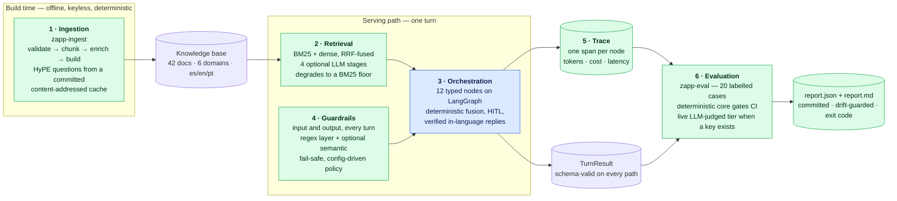

# Zapp Assist — documentation

Design documentation for the Zapp Assist multilingual support agent. The repo [README](../README.md)
covers what the system does and how to run it; these documents cover **why it is built the way it
is**, including where it falls short.

| Document | What it covers |
| --- | --- |
| **[System flow](system-flow.md)** | The system *across* its layers, in six diagrams: build vs serving vs verification time, one request through every component, artifact flow, the full degradation map, state lifetimes, and the module seam map. **Start here for the wide view.** |
| **[Architecture — the hub](architecture.md)** | What belongs to no single layer: the design stance, one turn end to end, the trade-off ledger, the ranked list of known gaps, and the production path. |
| **The six layer documents** | One per layer — see the table below. |
| [Constitution](../.specify/memory/constitution.md) | The engineering principles ratified before any code was written; every `plan.md` is gated against them. |
| [Feature specs](../specs/) | Per-feature `spec.md` / `plan.md` / `tasks.md` / `research.md` / `contracts/` for `001-support-agent`, `002-multilingual`, `003-guardrails`, `004-evaluation`. |

---

## The system in one picture



---

## The six layers — one document each

Each document opens with the **diagram of that layer**, then states what it does, the decisions
taken, the alternatives rejected, the cost accepted, and where it is still thin.

| Layer | Core decision | Degrades to | Document |
| --- | --- | --- | --- |
| **1 · Ingestion** | Enrichment runs **offline** into a committed, content-addressed cache — never on the serving path | authored questions, then empty + warning | **[layer-1-ingestion.md](layer-1-ingestion.md)** |
| **2 · Retrieval & storage** | Hybrid BM25 + dense via **RRF**; four LLM stages opt-in; Self-Query **boosts, never filters** | BM25 lexical floor, offline and keyless | **[layer-2-retrieval.md](layer-2-retrieval.md)** |
| **3 · Agent & orchestration** | Pure `(state, deps) -> state` nodes; **deterministic** HITL confirmation and language policy | degraded turn + `needs_review`, never a crash | **[layer-3-orchestration.md](layer-3-orchestration.md)** |
| **4 · Guardrails & security** | Two layers, **deterministic-first**; the semantic layer fails **safe**, never open; policy is config | regex layer alone + a review flag | **[layer-4-guardrails.md](layer-4-guardrails.md)** |
| **5 · Observability** | One span per node; cost attributed at the adapter, including retrieval-side spend | — *emission is the layer's open gap* | **[layer-5-observability.md](layer-5-observability.md)** |
| **6 · Evaluation** | Two tiers, one command: a **byte-stable** keyless gate plus a live LLM-judged tier | deterministic core alone | **[layer-6-evaluation.md](layer-6-evaluation.md)** |

Every layer document carries prev/next navigation, so they also read straight through in order.

---

## Verify any of this yourself

Every command below runs with **no API key and no network**:

```bash
uv sync
uv run pytest                              # 147 tests — unit, contract, integration
uv run ruff check . && uv run mypy src     # lint + types
uv run zapp-ingest validate                # knowledge-base structural + coverage gate
uv run zapp-eval                           # evaluation gate → report + exit code
```

A live run needs a key and the provider selected in [config.yaml](../config.yaml):

```bash
uv run zapp-assist turn --session demo --text "¿hasta cuándo puedo reprogramar mi entrega?"
uv run zapp-assist chat
```
