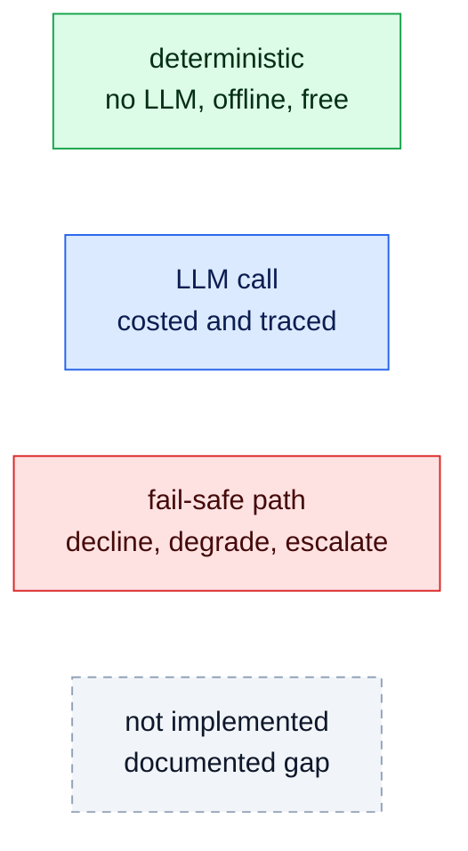
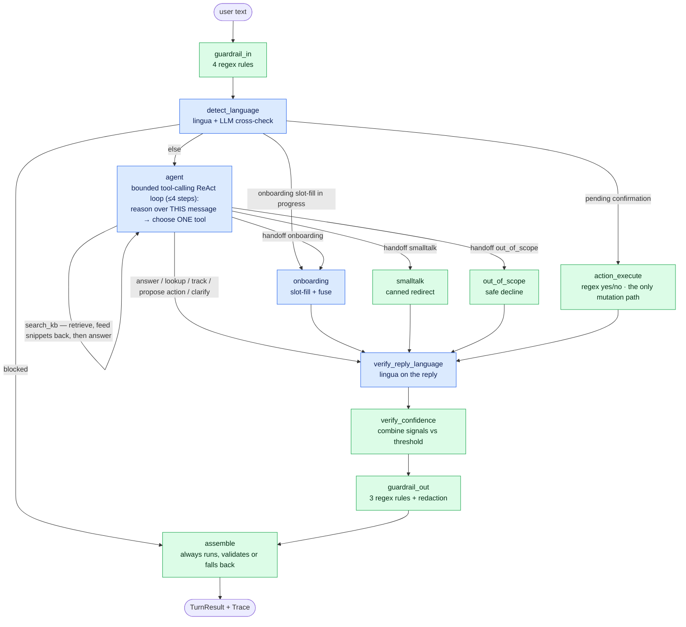

# Zapp Assist — Architecture in Six Layers

The hub for the design documentation. The system is built as six layers — **ingestion**,
**retrieval/storage**, **agent/orchestration**, **guardrails/security**, **observability**, and
**evaluation** — and **each one has its own document**, opening with the diagram of that layer:

| | | |
| --- | --- | --- |
| [1 · Ingestion](layer-1-ingestion.md) | [2 · Retrieval & storage](layer-2-retrieval.md) | [3 · Agent & orchestration](layer-3-orchestration.md) |
| [4 · Guardrails & security](layer-4-guardrails.md) | [5 · Observability](layer-5-observability.md) | [6 · Evaluation](layer-6-evaluation.md) |

This page holds what belongs to no single layer: the design stance, one turn end to end, the ledger
of every trade-off, the ranked list of what is missing, and the production path.

[README.md](../README.md) is the *what*. These documents are the *why*, plus an honest account of the
edges. Every claim is traceable to a file and line; where the code does less than the prose elsewhere
in the repo implies, that is called out explicitly rather than smoothed over.

For the wide view across layers — what runs at build vs serving vs verification time, one request
through every component, the full degradation map, and the module seam map — see
**[system-flow.md](system-flow.md)**.

---

## Table of contents

- [The design stance](#the-design-stance)
- [A turn, end to end](#a-turn-end-to-end)
- [The six layers](#the-six-layers) — one document each:
  - [1 · Ingestion](layer-1-ingestion.md)
  - [2 · Retrieval & storage](layer-2-retrieval.md)
  - [3 · Agent & orchestration](layer-3-orchestration.md)
  - [4 · Guardrails & security](layer-4-guardrails.md)
  - [5 · Observability](layer-5-observability.md)
  - [6 · Evaluation](layer-6-evaluation.md)
- [Cross-layer trade-off ledger](#cross-layer-trade-off-ledger)
- [Known gaps, ranked](#known-gaps-ranked)
- [If this went to production](#if-this-went-to-production)
- [Appendix: file map by layer](#appendix-file-map-by-layer)

---

## The design stance

Five invariants hold across all six layers. Everything else is a consequence of them.

**1. The LLM is a component, not the system.**
The model is consulted for what it is good at — reading intent, extracting entities, writing prose —
and is structurally prevented from deciding anything correctness- or safety-critical. Phone
normalization is `phonenumbers`. Language detection is `lingua`. Action confirmation is a regex
lexicon. In each case an LLM opinion is *also* collected, but only as a cross-check: agreement raises
`confidence_score`, disagreement lowers it and sets `needs_review`
([lang/detector.py:162-189](../src/zapp_assist/lang/detector.py#L162-L189),
[nodes/onboarding.py:59-87](../src/zapp_assist/graph/nodes/onboarding.py#L59-L87)).

**2. Every path ends in a valid contract.**
`TurnResult` is a Pydantic model with `extra="forbid"`
([contracts.py:53](../src/zapp_assist/contracts.py#L53)). `assemble` is the only exit and it runs even
when the turn is degraded ([graph/build.py:122](../src/zapp_assist/graph/build.py#L122)); it wraps
itself in a try/except whose handler builds `safe_fallback(...)`, which is constructed from clamped,
regex-checked primitives and therefore cannot fail validation
([contracts.py:68-105](../src/zapp_assist/contracts.py#L68-L105)). There is no code path that returns a
partial object, and no exception that reaches the caller.

**3. Failure degrades, it does not propagate.**
Every node is wrapped so an exception becomes an `error` span plus `degraded=True`
([graph/build.py:47-64](../src/zapp_assist/graph/build.py#L47-L64)). Every provider call maps expected
API errors to `LLMResult(degraded=True)` rather than raising
([llm/anthropic_adapter.py:86-89](../src/zapp_assist/llm/anthropic_adapter.py#L86-L89)). Every optional
enhancement — dense retrieval, HyDE, the semantic guardrail layer — returns "nothing" on failure and
the caller proceeds without it. Degradation is always *toward* the safe deterministic floor, never
toward silence and never toward fail-open.

**4. One seam per external dependency.**
LangGraph is imported in exactly one file. The Anthropic SDK in exactly one. OpenAI chat in one,
OpenAI embeddings in another. Session storage, the language detector, tools, guardrails, the
retriever, the judge — each sits behind a `Protocol`. This is not architecture-for-its-own-sake: it
was **cashed in mid-project**. `config.yaml` currently ships `provider: openai`
([config.yaml:8](../config.yaml#L8)) because the Anthropic account ran out of credits; the swap was one
config line and one new adapter file, with zero changes to any node.

**5. Configuration is data.**
Models, per-node reasoning effort, seven thresholds, supported languages, the pricing table,
guardrail policy, and every retrieval toggle live in [config.yaml](../config.yaml); eval thresholds in
[evals/eval_config.yaml](../evals/eval_config.yaml). Re-tuning the agent's caution, disabling a noisy
guardrail rule, or changing the CI gate requires no code change and no redeploy of logic.

These come from a project constitution ratified before any code was written
([.specify/memory/constitution.md](../.specify/memory/constitution.md)); each `plan.md` carries a
Constitution Check gate. The value of writing them down first is that the trade-offs below were
resolved *against a stated standard*, not improvised.

---

## A turn, end to end

### Reading the diagrams

Every diagram in this document uses the same four colours. They encode the design stance directly:
green is what works without a model, blue is what spends one, red is the fail-safe path, dashed grey
is something the code does **not** do yet.



### The turn graph



The single blue `agent` node replaces the old three-LLM understanding stage (a routing classifier, a
retrieval-answer node, and an action planner). It is a bounded ReAct loop: the model reasons over the
current message (recent history is context, never an action source) and picks exactly one tool per
step — `search_kb` (retrieval runs in-loop and feeds snippets back before the model answers; empty
retrieval → the model declines with `grounded=false`), the read-only `lookup_order`/`track_order`, a
state-changing tool that is **proposed and never executed here**, a final `answer`, or a `handoff`.
Two deterministic seams branch off `detect_language` *before* the agent: a pending action awaiting
confirmation goes straight to `action_execute` (the single human-in-the-loop gate, and the only path
to a backend mutation), and an onboarding slot-fill already in progress continues straight to
`onboarding`. `verify_reply_language` is drawn blue because it *may* spend a call, but it is
deterministic in the common case: the check itself is `lingua`, and a model is only consulted on an
actual mismatch.

Worked example — `"¿hasta cuándo puedo reprogramar mi entrega?"` on a fresh session:

| # | Node | What happens | Signal produced |
|---|---|---|---|
| 1 | `guardrail_in` | 4 regex rules over the raw input; none fire | `guardrails.input = []` |
| 2 | `detect_language` | `is_foreign` guard says not-foreign → `lingua` says `es` (0.94) → LLM second opinion says `es` → `fuse` applies the agreement boost → first confident detection **locks** `active_lang="es"` | `lang_confidence ≈ 0.96` |
| 3 | `agent` | The tool-calling loop: step 1 chooses `search_kb`; hybrid retrieval (BM25 over folded/stopworded tokens ∪ dense cosine over doc+HyPE-question vectors, RRF-fused → `delivery_reschedule_es` at rank 1) runs in-loop and feeds the snippets back; step 2 chooses `answer`, generated **strictly from the snippets**, with a `grounded` flag the model can set false. One span, two LLM calls | `intent = support`, `grounding_confidence = 0.6 + 0.05·score` |
| 4 | `verify_reply_language` | `lingua` on the *reply*; `es == active_lang` → pass, no LLM spent | `reply_match=true` on the span |
| 5 | `verify_confidence` | mean of {language, intent, grounding} vs `review_confidence=0.6` | `confidence_score`, `needs_review` |
| 6 | `guardrail_out` | 3 output rules (PII leak, ungrounded backstop, instruction disclosure); none fire | `guardrails.output = []` |
| 7 | `assemble` | Builds and validates `TurnResult` | the contract |

Three LLM calls (one to detect language, two inside the agent loop — `search_kb` then `answer`), one
embedding call (the KB was embedded once at construction), and a `Trace` with seven spans — the agent
emits **one** span per turn even though its loop spent two calls. The same question with no API key at
all still answers: retrieval falls back to BM25 and only the generation step is lost — which is
exactly the failure the decline path is designed for.

---

## The six layers

Each layer has **its own document**, opening with the diagram of that layer and then stating what it
does, the decisions taken, the alternatives rejected, the cost accepted, and where it is still thin.

| Layer | Core decision | Degrades to | Document |
| --- | --- | --- | --- |
| **1 · Ingestion** | Enrichment runs **offline** into a committed, content-addressed cache — never on the serving path | authored questions, then empty + warning | **[layer-1-ingestion.md](layer-1-ingestion.md)** |
| **2 · Retrieval & storage** | Hybrid BM25 + dense via **RRF**; four LLM stages opt-in; Self-Query **boosts, never filters** | BM25 lexical floor, offline and keyless | **[layer-2-retrieval.md](layer-2-retrieval.md)** |
| **3 · Agent & orchestration** | Pure `(state, deps) -> state` nodes; **deterministic** HITL confirmation and language policy | degraded turn + `needs_review`, never a crash | **[layer-3-orchestration.md](layer-3-orchestration.md)** |
| **4 · Guardrails & security** | Two layers, **deterministic-first**; the semantic layer fails **safe**, never open; policy is config | regex layer alone + a review flag | **[layer-4-guardrails.md](layer-4-guardrails.md)** |
| **5 · Observability** | One span per node; cost attributed at the adapter, including retrieval-side spend | — *emission is the layer's open gap* | **[layer-5-observability.md](layer-5-observability.md)** |
| **6 · Evaluation** | Two tiers, one command: a **byte-stable** keyless gate plus a live LLM-judged tier | deterministic core alone | **[layer-6-evaluation.md](layer-6-evaluation.md)** |

They are written to be read in order, but each stands alone. The rest of *this* document is the
cross-cutting material: the ledger of every trade-off, the ranked list of what is missing, and the
production path.

---

## Cross-layer trade-off ledger

| # | Decision | Chosen because | Rejected alternative | Cost accepted |
|---|---|---|---|---|
| 1 | Enrichment offline + content-addressed cache | KB rebuild is deterministic and keyless | serving-time enrichment; hand-authored JSON | committed cache is a trusted artifact |
| 2 | HyPE on by default; other 4 techniques off | its cost is paid at build time, not per query | always-on expansion | needs a rebuild when the KB changes |
| 3 | RRF over score normalization | no cross-scale calibration to get wrong | min-max / z-score fusion | a ×10 constant to report BM25-comparable confidence |
| 4 | Self-Query as boost, not filter | a wrong prediction must not delete the answer | hard metadata filter (shipped, then reverted) | weaker precision gain than a filter |
| 5 | BM25 floor everywhere | CI, tests, and eval stay keyless and offline | dense-only retrieval | lexical-only quality without a key |
| 6 | Qdrant vector store, embedded by default | a real, swappable vector DB with no service to run; a server is a one-line `qdrant_url` flip | NumPy-only; or a hosted DB up front | embedded `:memory:` doesn't persist — vectors re-embed at every process start |
| 7 | Whole `TurnState` in one graph channel | nodes stay plain functions, engine stays swappable | per-field channels + reducers | no automatic parallel-branch merging |
| 8 | Deterministic HITL confirmation | irreversible ops must not hinge on a model guess | LLM-parsed confirmation | fixed trilingual lexicon; unknown affirmations re-ask |
| 9 | Reply-language verified, one bounded correction | turns a prompt request into a guarantee | trust the prompt; loop until match | one extra call on genuine mismatch only |
| 10 | Sustained-switch (2 turns) language policy | coherence without thrashing on a quoted phrase | switch on any confident detection | a deliberate switch takes 2 turns |
| 11 | Semantic guardrails off by default, fail-safe | baseline stays free, deterministic, reproducible | always-on classification | paraphrased attacks need the toggle |
| 12 | Action ordering, not severity ordering | action decides behavior; severity is a label | severity-ranked precedence | a high-severity redact only redacts |
| 13 | Signals in the trace, not the contract | contract is a caller interface, frozen | add fields to `TurnResult` | consumers must read traces for diagnostics |
| 14 | Hand-rolled `Trace`, no OTel | small, dependency-free, export-shaped | OpenTelemetry | needs an exporter written (and an emitter) |
| 15 | In-repo eval, not LangSmith/Langfuse | a reproducible gate, not a dashboard | hosted / self-hosted platform | no trends UI; complementary, added later |
| 16 | Two eval tiers, auto-activated | reproducible gate **and** real quality numbers | one mode | committed report mixes stable and unstable rows |
| 17 | Mock backend for order/account actions | HITL and exactly-once semantics are the real subject | a stub API service | persistence is not exercised |

---

## Known gaps, ranked

Ordered by what would matter most in production, not by effort.

1. **Embeddings are recomputed at every process start** and never persisted — fine for a CLI,
   untenable for a service. The cache pattern to fix it already exists one layer up. → [Layer 2](layer-2-retrieval.md#storage)
2. **The full `Trace` has no export path.** A structured summary line is now emitted per turn, but
   the complete span tree is not returned or exported (OTel/Langfuse). → [Layer 5](layer-5-observability.md#gap-the-trace-summary-is-emitted-a-full-trace-export-path-is-not)
3. **Sessions are not shared across replicas.** A file-backed store ships and is used by the CLI, but
   a shared multi-replica backend (Redis) is not yet built. → [Layer 3](layer-3-orchestration.md#storage-and-scaling-posture)

*Recently closed (see git history):* input-side PII `redact` is now applied (Layer 4), one structured
log line per turn is emitted (Layer 5), and a keyless CI workflow is committed (Layer 6). Those three
layers' detailed gap sections predate the fixes and are pending a refresh.
5. **Guardrail precision/recall rests on 4 unsafe cases.** The machinery is right, the sample is a
   seed. → [Layer 6](layer-6-evaluation.md#what-the-numbers-do-and-do-not-mean)
6. **Retrieval is language-blind** across a parallel trilingual KB; language correctness is recovered
   at generation and verification rather than at retrieval. → [Layer 2](layer-2-retrieval.md#gap-retrieval-is-language-blind)
7. **The chunker is not wired into the index** — a reported statistic only. No effect today (longest
   doc: 339 chars); the 900/1200-char thresholds also disagree. → [Layer 1](layer-1-ingestion.md#gap-the-chunker-is-plumbed-but-not-indexed)
8. **`retrieval.top_k` is honored on one of three retriever paths.** No behavioral difference today
   because the value happens to match the hardcoded default. → [Layer 2](layer-2-retrieval.md#gap-retrievaltop_k-is-honored-on-one-path-of-three)
9. **One wasted LLM call on the blocked-input path** — a refused turn still pays for the
   `detect_language` second opinion. The old confirmation-turn waste is now gone: the pending-action
   gate branches off `detect_language`, so a yes/no turn skips the agent entirely instead of running
   an understanding call whose result is discarded. → [Layer 3](layer-3-orchestration.md#micro-inefficiencies-worth-naming)
10. **Session storage has two backends** (in-memory + a file-backed store the CLI uses, so `turn`
    persists across processes); the `SessionStore` swap point is *exercised* — a shared multi-replica
    store (e.g. Redis) is the remaining unproven step. → [Layer 3](layer-3-orchestration.md#storage-and-scaling-posture)
11. **The live Anthropic path is structurally exercised but not tested end-to-end** (no key in CI).
    The OpenAI adapter is currently the live path.

Items 1, 2, 4, and 9 are each under an hour. Item 3 is the only one that is genuinely architectural,
and it has a template to copy.

---

## If this went to production

**First week — close the stated-vs-built gaps.** Apply input-side redaction (#1). Emit one structured
log line per turn and give `run_turn` a trace sink (#2). Commit the CI workflow (#4). Guard the
remaining wasted LLM call on the blocked path (#9). None of these change the architecture; they make the code match what the
documentation already claims.

**First month — make the scaling seams real.** Persist embeddings behind a content-addressed cache,
reusing the ingestion pattern (#3). Implement `RedisSessionStore` against the existing protocol and
run two replicas to prove the seam (#10). Add a Langfuse exporter behind the trace sink — the
deterministic gate stays as-is; the platform becomes the trends and drill-down layer, which is what
it is actually good at.

**First quarter — earn the safety numbers.** Grow the adversarial guardrail dataset by an order of
magnitude, weighted toward near-misses, and gate on it. Turn on the semantic layer and measure the
precision cost of the recall gain rather than assuming it. Feed production `needs_review` turns back
into the dataset — the constitution's Continuous Learning principle is currently design posture, and
this is the concrete loop that discharges it. Gate live-tier latency, so the p95 number means
something.

**Ongoing — keep the seams honest.** The provider swap mid-project is the evidence that the isolation
was worth its cost. The value of a seam decays the moment something reaches through it, so the grep
checks that enforce "LangGraph appears in one file, each SDK in one file" belong in CI next to the
tests.

---

## Appendix: file map by layer

| Layer | Files | LOC |
|---|---|---|
| **Ingestion** | [ingestion/pipeline.py](../src/zapp_assist/ingestion/pipeline.py), [validate.py](../src/zapp_assist/ingestion/validate.py), [chunk.py](../src/zapp_assist/ingestion/chunk.py), [enrich.py](../src/zapp_assist/ingestion/enrich.py), [cli.py](../src/zapp_assist/ingestion/cli.py), [enrichment_cache.json](../src/zapp_assist/ingestion/enrichment_cache.json) | 540 |
| **Retrieval/storage** | [rag/store.py](../src/zapp_assist/rag/store.py), [dense.py](../src/zapp_assist/rag/dense.py), [hybrid.py](../src/zapp_assist/rag/hybrid.py), [advanced.py](../src/zapp_assist/rag/advanced.py), [retriever.py](../src/zapp_assist/rag/retriever.py), [embedder.py](../src/zapp_assist/rag/embedder.py), [kb/](../src/zapp_assist/rag/kb/) (42 docs), [memory/session_store.py](../src/zapp_assist/memory/session_store.py) | 731 |
| **Agent/orchestration** | [agent.py](../src/zapp_assist/agent.py), [contracts.py](../src/zapp_assist/contracts.py), [config.py](../src/zapp_assist/config.py), [graph/build.py](../src/zapp_assist/graph/build.py), [state.py](../src/zapp_assist/graph/state.py), [deps.py](../src/zapp_assist/graph/deps.py), [nodes/](../src/zapp_assist/graph/nodes/) (11 nodes), [llm/](../src/zapp_assist/llm/), [lang/detector.py](../src/zapp_assist/lang/detector.py), [tools/](../src/zapp_assist/tools/), [cli.py](../src/zapp_assist/cli.py) | 2902 |
| **Guardrails/security** | [guardrails/registry.py](../src/zapp_assist/guardrails/registry.py), [baseline.py](../src/zapp_assist/guardrails/baseline.py), [semantic.py](../src/zapp_assist/guardrails/semantic.py), [nodes/guardrail_in.py](../src/zapp_assist/graph/nodes/guardrail_in.py), [guardrail_out.py](../src/zapp_assist/graph/nodes/guardrail_out.py), [out_of_scope.py](../src/zapp_assist/graph/nodes/out_of_scope.py) | 526 |
| **Observability** | [obs/trace.py](../src/zapp_assist/obs/trace.py) — the span helper itself lives in [nodes/_util.py](../src/zapp_assist/graph/nodes/_util.py) (counted above) | 89 |
| **Evaluation** | [evals/cli.py](../evals/cli.py), [runner.py](../evals/runner.py), [models.py](../evals/models.py), [metrics.py](../evals/metrics.py), [judge.py](../evals/judge.py), [report.py](../evals/report.py), [scripted_llm.py](../evals/scripted_llm.py), [quality_tier.py](../evals/quality_tier.py), [dataset/](../evals/dataset/) (20 cases), [eval_config.yaml](../evals/eval_config.yaml) | 985 |
| **Specs & governance** | [.specify/memory/constitution.md](../.specify/memory/constitution.md), [specs/001-support-agent/](../specs/001-support-agent/), [002-multilingual/](../specs/002-multilingual/), [003-guardrails/](../specs/003-guardrails/), [004-evaluation/](../specs/004-evaluation/) | — |
| **Tests** | [tests/unit/](../tests/unit/), [tests/contract/](../tests/contract/), [tests/integration/](../tests/integration/), [tests/support/](../tests/support/) | 207 tests |

Verification, all keyless:

```bash
uv run pytest                              # 207 tests
uv run ruff check . && uv run mypy src     # lint + types
uv run zapp-ingest validate                # KB structural + coverage gate
uv run zapp-eval                           # eval gate → report + exit code
```
