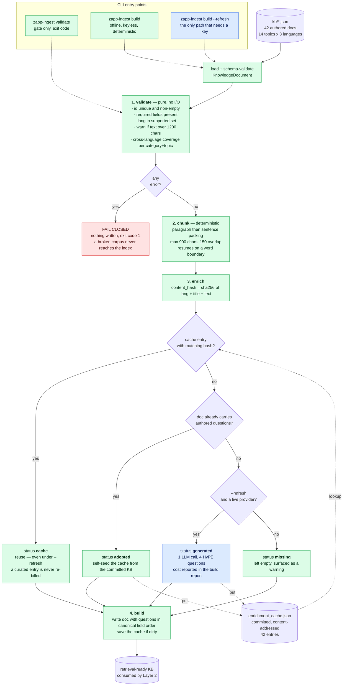

# Layer 1 — Ingestion

[All six layers](architecture.md#the-six-layers)  ·  [Layer 2 · Retrieval & storage](layer-2-retrieval.md) →

---

> `zapp-ingest` — the knowledge base is **built**, not hand-maintained.
> [src/zapp_assist/ingestion/](../src/zapp_assist/ingestion/)

**The load-bearing property:** only one box in this diagram is blue, and it is reachable only under
an explicit `--refresh`. Everything on the path that CI and a fresh clone actually run is green —
which is what makes "rebuild the knowledge base" a deterministic, keyless, reviewable operation.

## What it produces

42 curated FAQ documents = **14 topics × 3 languages (ES/EN/PT)** across six support domains —
`delivery`, `account`, `payments`, `orders`, `returns`, `membership` — each tagged with
`category`/`topic` metadata and carrying **4 HyPE hypothetical questions** it answers
([rag/kb/](../src/zapp_assist/rag/kb/)). Documents run 213–339 characters: deliberately short, single-
claim, retrievable units.

## The pipeline

`validate → chunk → enrich → build`, orchestrated by
[ingestion/pipeline.py:64-113](../src/zapp_assist/ingestion/pipeline.py#L64-L113).

**validate** ([ingestion/validate.py](../src/zapp_assist/ingestion/validate.py)) — id uniqueness, empty
required fields, unsupported language, over-length warning, and a **cross-language coverage check**:
every `(category, topic)` pair must exist in all supported languages, or the build warns with the
exact missing set. Errors fail closed — `build_kb` returns before writing anything
([pipeline.py:80-82](../src/zapp_assist/ingestion/pipeline.py#L80-L82)) — so a broken corpus can never
be half-written. It is a pure function over already-loaded models, which is why it is trivially
unit-tested (10 tests in [test_ingestion.py](../tests/unit/test_ingestion.py)).

**chunk** ([ingestion/chunk.py](../src/zapp_assist/ingestion/chunk.py)) — deterministic paragraph→
sentence packing into ≤900-char windows with ~150 chars of overlap, resuming at a word boundary so
no chunk starts mid-word.

**enrich** ([ingestion/enrich.py](../src/zapp_assist/ingestion/enrich.py)) — the only provider-dependent
stage, and the most consequential design decision in this layer.

## Decision: enrichment is offline, content-addressed, and committed

HyPE questions are generated by an LLM, then stored in a committed cache keyed by
`sha256(lang ‖ title ‖ text)` ([enrich.py:48-52](../src/zapp_assist/ingestion/enrich.py#L48-L52)). Four
resolution states, in strict precedence:

| State | Condition | Effect |
|---|---|---|
| `cache` | hash matches a committed entry | reuse — **even under `--refresh`**, so a curated entry is never regenerated or re-billed |
| `adopted` | no entry, but the file already has questions | self-seed the cache from the committed KB |
| `generated` | `--refresh` + a live provider, for an uncovered doc | one LLM call, then cached |
| `missing` | none of the above | left empty, reported as a warning |

**Why:** the KB rebuild must be deterministic and keyless, or CI cannot verify it and the committed
eval report is not reproducible. Content-addressing means a doc whose text changes automatically
invalidates only its own enrichment — no manual cache busting, no stale questions silently attached
to rewritten text.

**Rejected:** *hand-authoring the enriched JSON* (not reproducible, unvalidated, and the questions
drift from the text they claim to cover); *generating enrichment at serving time* (adds an LLM call,
latency, cost, non-determinism, and a key dependency to **every user turn** — the single worst place
to put a batch workload).

**Cost accepted:** the cache is a committed artifact that a reviewer must trust; a malicious or
careless edit to `enrichment_cache.json` changes retrieval behavior without touching any `.py`. The
content hash detects *doc* drift, not *cache* tampering. Mitigation if this mattered: sign the cache
or regenerate it in CI on a schedule.

## Gap: the chunker is plumbed but not indexed

`build_kb` calls `chunk_text` only to **report** a chunk count
([pipeline.py:94](../src/zapp_assist/ingestion/pipeline.py#L94)); the written document keeps its whole
`text`, and both retrievers index `title + text` as one unit
([rag/store.py:77](../src/zapp_assist/rag/store.py#L77),
[rag/dense.py:51](../src/zapp_assist/rag/dense.py#L51)). Today this is a distinction without a
difference — the longest document is 339 chars, so every doc is exactly one chunk. But the
machinery implies chunk-level retrieval that does not exist, and the thresholds disagree: the
chunker splits at 900 chars while the validator only warns at 1200
([validate.py:19](../src/zapp_assist/ingestion/validate.py#L19)), so a 1000-char doc would be silently
accepted, silently un-chunked, and indexed as one diluted vector.

**Fix:** emit chunks as first-class retrievable rows with a `parent_id`, and align the two
thresholds. That is also the natural on-ramp to parent-document retrieval, which was deliberately
deferred (see Layer 2).

---

---

[All six layers](architecture.md#the-six-layers)  ·  [Layer 2 · Retrieval & storage](layer-2-retrieval.md) →

Wider context: [system flow across all layers](system-flow.md)  ·  [design stance and known gaps](architecture.md)
