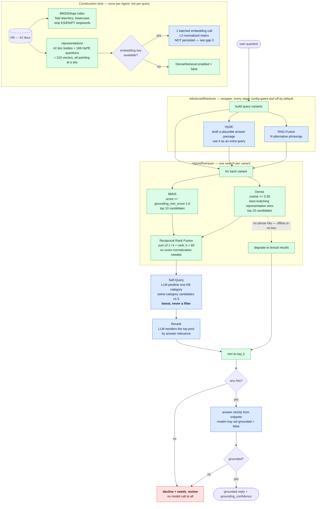

# Layer 2 — Retrieval & storage

← [Layer 1 · Ingestion](layer-1-ingestion.md)  ·  [All six layers](architecture.md#the-six-layers)  ·  [Layer 3 · Agent & orchestration](layer-3-orchestration.md) →

---

> Hybrid BM25 + dense with RRF, five config-gated enhancements, and a deterministic floor.
> [src/zapp_assist/rag/](../src/zapp_assist/rag/)



**How to read the degradation:** delete every blue box and the diagram still terminates correctly —
BM25 into RRF into trim into the grounding gate. That is the no-key path, and it is the one CI runs.

## The shape

```
support_rag ─→ Retriever (Protocol)
                 └─ AdvancedRetriever      (optional wrapper: RAG-Fusion, HyDE, Self-Query, rerank)
                      └─ HybridRetriever   (RRF over the two below)
                           ├─ BM25Store    ← always available, offline, deterministic
                           └─ DenseRetriever ← disabled without an embedding key
```

Every layer above `BM25Store` is optional, and every one of them **degrades to the layer below**
rather than failing. With no key: `OpenAIEmbedder.available` is false → `DenseRetriever.enabled` is
false → `HybridRetriever` returns the sparse hits
([hybrid.py:59-60](../src/zapp_assist/rag/hybrid.py#L59-L60)) → the system still grounds, still
declines correctly, and still passes its tests. This is the property that keeps CI keyless.

## Decision: RRF instead of score normalization

BM25 scores are unbounded and corpus-dependent; cosine similarity is [-1, 1]. Fusing them by
normalizing means inventing a mapping that is wrong the moment the corpus changes. Reciprocal Rank
Fusion ignores magnitudes entirely — a document scores `Σ 1/(k + rank)` across lists
([hybrid.py:24-31](../src/zapp_assist/rag/hybrid.py#L24-L31)) — so a document ranked well by *either*
retriever surfaces, with `k=60` damping the tail.

The wrinkle: the *downstream* consumer wants a confidence number, not a rank. The compromise is to
rank by RRF but report the document's original score — its BM25 score if lexical found it, else its
cosine scaled by 10× onto a BM25-ish range
([hybrid.py:63-67](../src/zapp_assist/rag/hybrid.py#L63-L67)). That constant is a calibration hack and
is labelled as one in the source. It works because `grounding_confidence` is itself a coarse map
(`min(1, 0.6 + 0.05·score)`, [support_rag.py:42-44](../src/zapp_assist/graph/nodes/support_rag.py#L42-L44))
feeding a single threshold decision. If confidence ever drove finer-grained behavior, this would
need real calibration against labelled relevance.

## Decision: HyPE is always on; the other four are off by default

**HyPE** (Hypothetical Prompt Embeddings) indexes each document's generated questions as *additional
vectors pointing at the same document*, and a document scores by its best-matching representation
([dense.py:44-57](../src/zapp_assist/rag/dense.py#L44-L57), [dense.py:73-78](../src/zapp_assist/rag/dense.py#L73-L78)).
This makes the match **question-to-question** rather than question-to-answer-prose — symmetric, and
much more robust to how a customer actually phrases things. It is on by default because its cost was
paid **offline** at ingestion time: zero serving-path latency, zero serving-path key requirement.

The other four each cost one or more LLM calls **per query**, so they are opt-in
([config.yaml:93-98](../config.yaml#L93-L98)):

| Technique | Extra LLM calls/query | Attacks | Default |
|---|---|---|---|
| HyPE | 0 (offline) | vocabulary gap, question/answer asymmetry | **on** |
| RAG-Fusion | 1 (+N extra retrievals) | phrasing variance | off |
| HyDE | 1 | answer-shaped matching | off |
| Self-Query | 1 | wrong-domain retrieval | off |
| Rerank | 1 | lexical mis-ranking of the fused pool | off |

The judgment is that a technique whose cost can be moved to build time should be, and a technique
that taxes every query should have to justify itself per deployment.

## The bug that changed a design: Self-Query became a boost, not a filter

Self-Query originally *filtered* candidates to the LLM-predicted category. A live smoke test showed
the failure mode: for *"money back for a cancelled order"* the classifier predicted `returns`, and
the hard filter **dropped the correctly-retrieved `payments` document** — a precision heuristic
destroying recall on exactly the ambiguous queries where retrieval matters most.

It was replaced with a soft ×1.5 boost on the fusion score
([advanced.py:193-212](../src/zapp_assist/rag/advanced.py#L193-L212), commit `b3cdcb0`). A correct
prediction still lifts the right domain; a wrong prediction can now never remove a document. This is
the general principle worth extracting: **when an LLM signal gates a pipeline, prefer re-ranking to
filtering** — a re-rank error costs position, a filter error costs the answer.

## Decision: the decline gate lives in retrieval, not in the prompt

"Decline rather than hallucinate" is enforced at three independent points, in order of reliability:

1. **Retrieval threshold (deterministic).** BM25 tokenization folds diacritics and strips a
   trilingual stopword list ([store.py:26-37](../src/zapp_assist/rag/store.py#L26-L37)) so that common
   words cannot manufacture a match; anything below `grounding_min_score = 1.0` is discarded. No
   hits → `support_rag` declines and sets `needs_review` **without calling the model at all**
   ([support_rag.py:64-66](../src/zapp_assist/graph/nodes/support_rag.py#L64-L66)).
2. **Generation escape hatch.** The response schema carries `grounded: bool`; the system prompt
   instructs the model to set it false rather than answer
   ([support_rag.py:27-34](../src/zapp_assist/graph/nodes/support_rag.py#L27-L34)). A false value
   routes to the same decline.
3. **Output guardrail backstop.** If retrieval was attempted, returned nothing, and the reply is
   nonetheless assertive, the `ungrounded` rule escalates
   ([baseline.py:117-124](../src/zapp_assist/guardrails/baseline.py#L117-L124)).

Only step 2 depends on model compliance, and it is sandwiched between two deterministic checks.

## Storage

The dense side sits behind a `VectorStore` seam
([vector_store.py](../src/zapp_assist/rag/vector_store.py)) with two backends: exact in-memory NumPy
cosine, and **Qdrant** — a real vector database in **embedded/in-process mode** by default (no
server, no network), or a Qdrant server via `qdrant_url` with server-side payload filtering as the
metadata-scale path. It is selected by `config.retrieval.vector_store` (default `qdrant`), degrading
to NumPy if `qdrant-client` is absent. The KB is 42 JSON files loaded at construction; BM25 builds
its own in-memory index; dense embeds 210 representations (42 docs + 168 HyPE questions) in a single
batched call and upserts them into the store. At this corpus size exact NumPy cosine is optimal;
Qdrant makes the store a real, swappable component and turns server-mode into a one-line change.

**But this is where the layer's clearest scaling gap is:** in embedded mode Qdrant holds vectors
in-process, so embeddings are computed **at every process start** and never persisted. One
`Agent.create()` = one 210-input embedding call. That is tolerable for a CLI and for the eval (which
deliberately builds one agent and reuses it,
[quality_tier.py:167](../evals/quality_tier.py#L167)), and untenable for a web service that restarts
pods. The fix is a **persistent Qdrant** (server mode, or a local on-disk path) or applying the
ingestion layer's content-addressed cache pattern to vectors — hash the representation, store the
vector, commit or persist it. Same idea, same determinism benefit.

## Gap: retrieval is language-blind

The KB is parallel across ES/EN/PT and nothing filters on `lang`. A Spanish query can ground on the
English sibling document. In practice the answer is still correct and still Spanish — the generation
prompt pins the output language and Layer 3 *verifies* it — so this reads as cross-lingual grounding
rather than a bug. It is nonetheless unintended: it doubles the effective index for every query, and
citations may reference a document in a language the user never used. `Self-Query` already
demonstrates the mechanism (metadata-driven scoring); `lang` should get the same soft boost toward
`active_lang`.

## Gap: `retrieval.top_k` is honored on one path of three

`support_rag` calls `search()` without a `top_k`
([support_rag.py:63](../src/zapp_assist/graph/nodes/support_rag.py#L63)). `HybridRetriever` defaults it
to `None` and therefore falls through to the configured value
([hybrid.py:52](../src/zapp_assist/rag/hybrid.py#L52)), but `BM25Store` and `AdvancedRetriever` both
default the parameter to a literal `3`
([store.py:96](../src/zapp_assist/rag/store.py#L96),
[advanced.py:115](../src/zapp_assist/rag/advanced.py#L115)), so `top_k or self._top_k` never consults
the config. There is no behavioral difference today because the configured value *is* 3 — which is
precisely why it is worth writing down: a config knob that silently does nothing on two of three code
paths is a latent surprise, not a current bug.

---

---

← [Layer 1 · Ingestion](layer-1-ingestion.md)  ·  [All six layers](architecture.md#the-six-layers)  ·  [Layer 3 · Agent & orchestration](layer-3-orchestration.md) →

Wider context: [system flow across all layers](system-flow.md)  ·  [design stance and known gaps](architecture.md)
