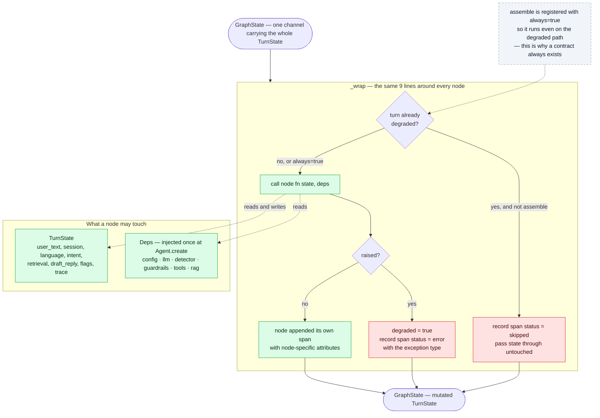
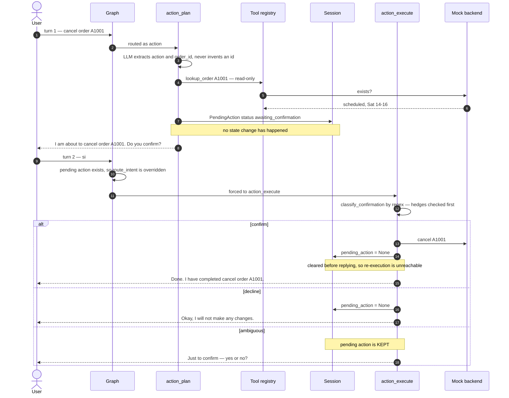
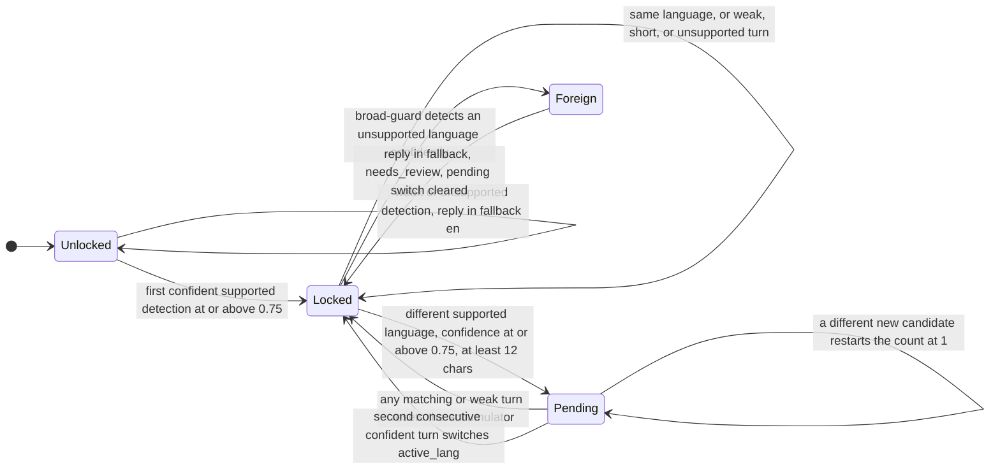

# Layer 3 — Agent & orchestration

← [Layer 2 · Retrieval & storage](layer-2-retrieval.md)  ·  [All six layers](architecture.md#the-six-layers)  ·  [Layer 4 · Guardrails & security](layer-4-guardrails.md) →

---

> A typed LangGraph over 12 pure nodes, with the framework confined to one file.
> [src/zapp_assist/graph/](../src/zapp_assist/graph/)

The turn graph itself is drawn in [The turn graph](architecture.md#the-turn-graph) above. The three diagrams here
show the parts of the layer that the graph shape does not reveal: how a node is wrapped, how
human-in-the-loop spans two turns, and how the session language is governed.

## Anatomy of one node execution



No node imports LangGraph, and no node imports a vendor SDK — which is why each one is testable by
calling it as a plain function, with no graph involved.

## Human-in-the-loop across two turns



The two properties worth naming: the router's opinion **cannot** hijack a pending confirmation
(step 8), and the pending action is cleared **before** the reply is built, so a duplicate execution
has no state to act on. The backend is idempotent as well, but that is defence in depth, not the
mechanism.

## Session language — lock, persist, switch



A single quoted English phrase inside a Spanish conversation lands on the `Pending --> Locked` reset
edge and changes nothing. A deliberate switch costs two turns. The whole policy is a pure function
with ten unit tests — no model, no session-store round trip, no ambiguity.

## The node contract

Every node is `(TurnState, Deps) -> TurnState`. No node imports LangGraph. No node imports a vendor
SDK. Dependencies arrive through a frozen `Deps` dataclass
([graph/deps.py:22-29](../src/zapp_assist/graph/deps.py#L22-L29)); state is a single dataclass threaded
through a single graph channel ([graph/state.py:45-75](../src/zapp_assist/graph/state.py#L45-L75)).

The one-channel choice matters. LangGraph's native model is per-field channels with reducers; adopting
it would have leaked the engine's merge semantics into every node signature. Putting the whole
`TurnState` in one channel keeps nodes as plain functions — testable by calling them, with no graph
at all — at the cost of losing LangGraph's automatic parallel-branch merging. Given that this turn
pipeline is inherently sequential, that cost is zero and the isolation benefit is total: swapping the
orchestrator means rewriting [graph/build.py](../src/zapp_assist/graph/build.py), one 145-line file.

## The node runner: skip-on-degraded, error-to-degraded, always-assemble

```python
if ts.degraded and not always:      # already broken → don't compound it
    ts.trace.add_span(Span(node=name, status="skipped"))
    return {"ts": ts}
try:
    ts = fn(ts, deps)
except Exception as exc:            # never crash — degrade and record
    ts.degraded = True
    ts.trace.add_span(Span(node=name, status="error", attrs={"error": type(exc).__name__}))
```
— [graph/build.py:50-62](../src/zapp_assist/graph/build.py#L50-L62)

Three properties fall out of nine lines: a failure cannot cascade into nodes that would misinterpret
partial state; every skip and every error is *visible in the trace* rather than inferred from
silence; and `assemble` is registered with `always=True`
([build.py:115](../src/zapp_assist/graph/build.py#L115)) so the contract is produced no matter how badly
the middle of the graph went. The failure mode of this design is the opposite of the usual one — it
is biased toward *too many* `needs_review=true` turns, which is the correct direction for a support
agent that hands off to humans.

## Decision: human-in-the-loop is deterministic, and routing cannot override it

State-changing actions never execute in the turn that requests them. `action_plan` verifies the order
exists, records a `PendingAction(status="awaiting_confirmation")`, restates the operation in the
user's language, and asks
([nodes/action_plan.py:70-78](../src/zapp_assist/graph/nodes/action_plan.py#L70-L78)). The next turn is
then treated as a confirmation **regardless of how the router classified it**:

```python
pending = ts.session.pending_action
if pending is not None and pending.status == "awaiting_confirmation":
    return "action_execute"
```
— [graph/build.py:76-79](../src/zapp_assist/graph/build.py#L76-L79)

Confirmation is read by regex, not by the model
([nodes/_action.py:36-48](../src/zapp_assist/graph/nodes/_action.py#L36-L48)) — and hedges are checked
*first*, so `"not sure"` cannot match on the `sure` inside it. The classification is three-valued:

- `confirm` → execute **once**, then `pending_action = None` — it is now unreachable, so double
  execution is structurally impossible ([action_execute.py:66-76](../src/zapp_assist/graph/nodes/action_execute.py#L66-L76));
- `decline` → discard, no backend call;
- `ambiguous` → **keep pending and re-ask.** An unclear answer never executes.

The mock backend is *additionally* idempotent — re-cancelling a cancelled order is a no-op that does
not increment `state_changes`
([tools/mock_backend.py:88-96](../src/zapp_assist/tools/mock_backend.py#L88-L96)) — as defense in depth,
not as the primary mechanism.

**Why deterministic:** these are irreversible operations against a customer's money and orders. An
LLM confirmation parser has some non-zero false-positive rate on inputs like *"no, wait — yes go
ahead"*; a regex lexicon has a **knowable, testable** one, covered by 12 integration tests
([test_us3_action.py](../tests/integration/test_us3_action.py)). The trade is expressiveness for
auditability, and for this class of operation that trade is not close.

**Cost accepted:** the lexicon is trilingual and finite. `"dale"`, `"vale"`, `"beleza"` are not in it
and will read as ambiguous — which produces a re-ask, the safe failure. The right production upgrade
is a small classifier *whose output is still gated by* the lexicon, not one that replaces it.

## Decision: multilingual output is verified, not requested

Asking the model to reply in Spanish is a request. `verify_reply_language` makes it a guarantee
([nodes/verify_reply_language.py](../src/zapp_assist/graph/nodes/verify_reply_language.py)):

1. Run the **deterministic** detector on the drafted reply — free, offline, no model call.
2. Match → done. This is the common case, so the guarantee usually costs nothing.
3. Mismatch → **exactly one** LLM rewrite, then re-check deterministically.
4. Still wrong → replace with a safe in-language template and set `needs_review`.

The bound is the design. An unbounded correction loop trades a latency spike for a quality gain that
a second attempt rarely delivers; one re-ask then fail-safe is the resilient shape, and it mirrors
the adapter's single repair re-ask. Replies under `reply_verify_min_chars = 15` skip verification
entirely, because no detector is reliable on *"OK"* and the short replies the agent emits are canned
per-language anyway.

Session language is governed by a separate **sustained-switch policy**
([lang/detector.py:114-159](../src/zapp_assist/lang/detector.py#L114-L159)) — a pure function, ten unit
tests. First confident detection locks; after that, switching requires **2 consecutive** confident
(≥0.75) turns of ≥12 characters in another supported language, and any matching or weak turn resets
the accumulator. A quoted English phrase mid-Spanish conversation is therefore a no-op. A genuinely
unsupported language short-circuits before any LLM call, replies in the fallback language, clears any
pending switch, and flags for review
([detect_language.py:36-51](../src/zapp_assist/graph/nodes/detect_language.py#L36-L51)).

## The cost dial

Per-turn LLM call counts, which is what actually determines latency and unit economics:

| Path | Calls | Breakdown |
|---|---|---|
| Blocked by input guardrail | **1** | `detect_language` |
| Confirmation turn (`"sí"`) | **2** | `detect_language`, `route_intent` *(discarded)* |
| Out-of-scope | 2–3 | + reply-language check on mismatch |
| Support / onboarding / action-plan | **3** | detect, route, answer |
| Support, all retrieval enhancements on | 7 | + HyDE, RAG-Fusion, Self-Query, rerank |
| …plus the semantic guardrail layer | 9 | + input and output classification |
| …plus a language correction | 10 | + one rewrite |

The default configuration is the 3-call row. Everything above it is a deliberate, per-deployment
opt-in — which is the point of putting all five retrieval toggles and the semantic switch in config
rather than in code.

## Micro-inefficiencies worth naming

Reading that table surfaces two wasted calls, both cheap to reclaim:

- **A blocked turn still pays for `detect_language`.** The graph blocks at `guardrail_in` but only
  branches to `assemble` *after* language detection
  ([build.py:118-121](../src/zapp_assist/graph/build.py#L118-L121)), because the refusal must be
  localized. Correct, but the deterministic detector alone is sufficient for choosing a canned
  template — the LLM second opinion buys nothing on input that is being refused. Guarding that call
  with `if not state.blocked` removes an LLM call from the hostile-input path, which is exactly the
  path an attacker can drive at volume.
- **A confirmation turn pays for a routing call whose answer is discarded.** `route_intent` runs,
  then `_after_intent` overrides it because a `pending_action` exists. Checking `pending_action`
  before the routing node — a conditional edge out of `detect_language` — makes yes/no turns cost one
  call instead of two.

Neither is a correctness issue. Both are the kind of thing that shows up as a 30% cost line item at
scale, and both are visible precisely *because* the trace counts calls per node.

## Storage and scaling posture

`SessionStore` is a protocol with an in-memory implementation that exchanges **deep copies** on
`load`/`save` ([memory/session_store.py:66-75](../src/zapp_assist/memory/session_store.py#L66-L75)), so
an in-flight turn cannot mutate stored state — a half-processed turn that crashes leaves the session
exactly as it was. Nodes are stateless and side-effect-free.

The honest statement is: this is *designed* for horizontal scale and not *proved* at it. The
process-local store means two replicas do not share sessions, and the swap point — while genuinely
clean, since no node touches the store — has never been exercised against Redis. What the design does
guarantee is that the swap is a new class implementing two methods, not a refactor.

---

---

← [Layer 2 · Retrieval & storage](layer-2-retrieval.md)  ·  [All six layers](architecture.md#the-six-layers)  ·  [Layer 4 · Guardrails & security](layer-4-guardrails.md) →

Wider context: [system flow across all layers](system-flow.md)  ·  [design stance and known gaps](architecture.md)
