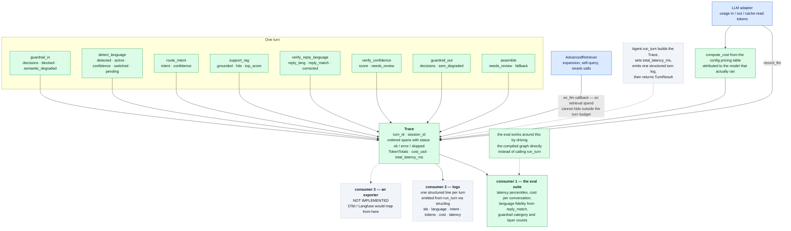

# Layer 5 — Observability

← [Layer 4 · Guardrails & security](layer-4-guardrails.md)  ·  [All six layers](architecture.md#the-six-layers)  ·  [Layer 6 · Evaluation](layer-6-evaluation.md) →

---

> One `Span` per node, token/cost/latency accounting per turn, feeding the eval suite.
> [src/zapp_assist/obs/trace.py](../src/zapp_assist/obs/trace.py)

**This is the one layer where the diagram is more honest than the code.** Capture is complete and
well-designed — every node, every token, every cost, including retrieval-side spend that would
otherwise be invisible. Emission does not exist: three dashed boxes, and the only working consumer
reaches the trace by bypassing the public entry point.

## What is captured

A `Trace` per turn carries `turn_id`, `session_id`, an ordered span list, `TokenTotals`
(input/output/cache-read), cumulative `cost_usd`, and `total_latency_ms`
([trace.py:35-52](../src/zapp_assist/obs/trace.py#L35-L52)). Each node appends exactly one span with its
name, latency, status (`ok` | `error` | `skipped`), and free-form attributes — and the attributes are
chosen to answer the questions you actually ask during an incident:

| Node | Attributes | Answers |
|---|---|---|
| `guardrail_in` | `decisions`, `blocked`, `semantic_degraded` | why was this refused; was safety checking complete |
| `detect_language` | `detected`, `active`, `confidence`, `switched`, `pending` | why did it answer in that language |
| `route_intent` | `intent`, `confidence` | why did it take that branch |
| `support_rag` | `grounded`, `hits`, `top_score` | did it have grounding, and how strong |
| `verify_reply_language` | `reply_lang`, `reply_match`, `corrected` | did the language guarantee hold |
| `verify_confidence` | `score`, `needs_review` | why was this escalated |
| `assemble` | `needs_review`, `fallback` | was this a real answer or a degradation |

Cost is computed from the config pricing table at the adapter boundary
([trace.py:55-61](../src/zapp_assist/obs/trace.py#L55-L61)), so it is attributed to the model that
actually ran — including retrieval-side expansion calls, which report usage back through an `on_llm`
callback so they land in the *turn's* budget rather than vanishing
([advanced.py:171-172](../src/zapp_assist/rag/advanced.py#L171-L172),
[support_rag.py:63](../src/zapp_assist/graph/nodes/support_rag.py#L63)). That detail matters: retrieval
enhancements are the easiest place for LLM spend to hide.

## Decision: signals ride in the trace, not the contract

`reply_match`, guardrail layer/category counts, and per-signal confidences are span attributes, not
`TurnResult` fields. The contract is frozen (`extra="forbid"`) and is a *caller* interface; these are
*operator* signals. Adding them to the contract would couple every consumer to internal diagnostics
and break the schema for a signal only evaluation needs. The eval consumes the trace directly — which
is what the trace was designed for — and reads fidelity out of it without ever inspecting reply text
([trace.py:73-89](../src/zapp_assist/obs/trace.py#L73-L89)).

## Decision: a hand-rolled `Trace` instead of OpenTelemetry

The `Trace`/`Span` shape is deliberately OTel-compatible in spirit (named spans, latency, status,
attribute bags) without the dependency. At this scope OTel would add a collector, an exporter, and
configuration surface to produce data that currently has no consumer other than the in-repo eval.
The abstraction is small enough that an exporter is a mapping function, not a migration.

**This is the right call *given* an export path exists. It does not, yet — see below.**

## Gap: the trace summary is emitted; a full-trace export path is not

The layer's original weakest point — *nothing was emitted* — is now closed; what remains is an
export path:

- `structlog` is wired up: `Agent.run_turn` emits **one structured line per turn** (`turn_complete`)
  carrying the ids, language, intent, review flag, guardrail actions, span count, tokens, cost, and
  latency ([agent.py](../src/zapp_assist/agent.py), [obs/log.py](../src/zapp_assist/obs/log.py)). So
  the constitution's standard — "debuggable from logs alone" — **is met for a running agent**: the
  per-turn summary is enough to trace and cost-account a turn from logs.
- What is *not* yet exported is the **full `Trace` object** (the ordered per-span detail). The log
  line is a summary; the complete span tree still falls out of scope after the turn, and the eval is
  the only consumer that reads it in full — by driving the compiled graph directly to keep the trace
  ([evals/runner.py:43-52](../evals/runner.py#L43-L52)).

**Remaining fix, in order of cost:** (1) ~~emit one structured log line per turn~~ — **done**;
(2) return the trace alongside the result, or accept an optional sink callback, so callers can route
the full span tree; (3) add an OTel exporter behind the same
sink. Step 1 has closed the gap between the claim and the code; steps 2–3 deepen it.

---

---

← [Layer 4 · Guardrails & security](layer-4-guardrails.md)  ·  [All six layers](architecture.md#the-six-layers)  ·  [Layer 6 · Evaluation](layer-6-evaluation.md) →

Wider context: [system flow across all layers](system-flow.md)  ·  [design stance and known gaps](architecture.md)
