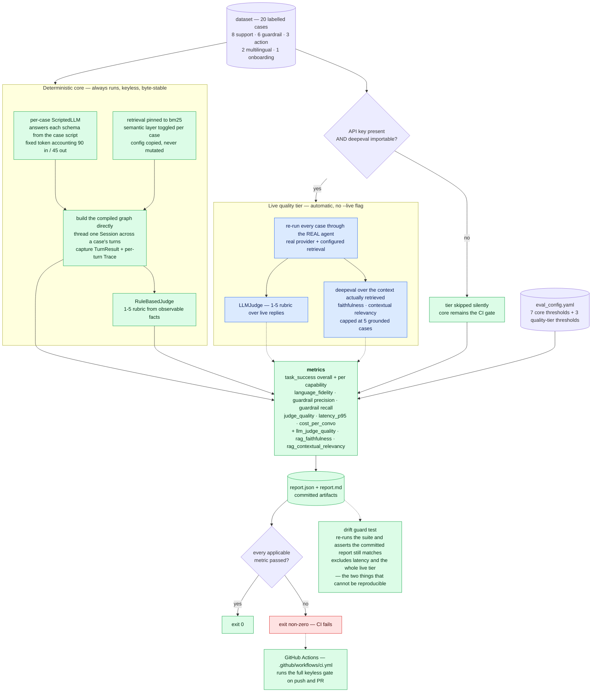

# Layer 6 — Evaluation

← [Layer 5 · Observability](layer-5-observability.md)  ·  [All six layers](architecture.md#the-six-layers)

---

> One command → one committed report → one exit code. [evals/](../evals/)

```bash
uv run zapp-eval    # → evals/report.{json,md}; exit 0 all-pass, non-zero on any failure
```



**The tier boundary is drawn exactly where reproducibility ends.** Everything green is byte-stable on
any machine with no network — that is why the committed report can be *verified* rather than trusted.
Everything blue is real but unrepeatable, so it is reported alongside and excluded from the drift
guard.

## Structure

20 labelled cases across six capabilities ([evals/dataset/](../evals/dataset/)) — 8 support, 6 guardrail,
3 action, 2 multilingual, 1 onboarding — each carrying a per-turn `MockScript` that pins the model's
behavior, and an `Expected` block whose **set fields alone** are checked
([metrics.py:22-40](../evals/metrics.py#L22-L40)). Partial labelling is a feature: a guardrail case
asserts `blocked` and `safety` and says nothing about `final_normalized_text`.

Seven gated metrics, all thresholded from [evals/eval_config.yaml](../evals/eval_config.yaml): task
success (overall + per capability), language fidelity, guardrail precision, guardrail recall,
LLM-as-judge quality, p95 latency, and cost per conversation.

## Decision: a pure observer, and it stays that way

`evals/` imports `zapp_assist`; nothing in `src/` imports `evals`. The runner needs the `Trace`,
which `run_turn` does not return — so instead of adding an API to the agent for the eval's
convenience, it builds the compiled graph itself and threads one `Session` across a case's turns
([runner.py:32-55](../evals/runner.py#L32-L55)). It also owns its own scripted LLM
([evals/scripted_llm.py](../evals/scripted_llm.py)) rather than importing `tests/support/mock_llm.py`,
because a shipped deliverable must not depend on the test package.

The runner is also careful with the cached config: `load_config` is `lru_cache`d, so per-case
overrides use `model_copy(update=…)` rather than mutation
([runner.py:23-29](../evals/runner.py#L23-L29)) — mutating it would silently corrupt every later case.

## Decision: two tiers, one command, key-adaptive

There is no `--live` flag. The suite detects what it can do:

**Deterministic core — always runs, keyless, byte-stable.** A per-case scripted model, a rule-based
judge, retrieval pinned to BM25. This is the CI gate: it runs identically on any machine with no
network, which is why the committed `report.json` can be *verified* rather than trusted. A drift-guard
test re-runs the suite and asserts the committed report still matches
([tests/unit/test_eval_report.py](../tests/unit/test_eval_report.py)), excluding wall-clock latency and
the live tier — the two things that legitimately cannot be reproducible.

**Live quality tier — activates when a key is present and `deepeval` is importable**
([evals/quality_tier.py](../evals/quality_tier.py)). It re-runs every case through the **real** agent
with the configured retrieval, scores replies with an LLM-as-judge on the 1–5 rubric, and adds
deepeval **faithfulness** and **contextual relevancy** measured over the context that was *actually
retrieved*. It is best-effort throughout: a failing case is skipped, a failing metric is skipped, and
the whole tier is wrapped so it can never break the core report
([quality_tier.py:179-180](../evals/quality_tier.py#L179-L180)). deepeval's RAG metrics are capped at 5
cases because each one fans out into many sub-calls.

**Why two tiers rather than one:** they measure different things and have incompatible requirements.
A gate must be reproducible; a quality measurement must be real. Forcing them into one mode means
either a CI gate that needs a key and a network, or a quality claim produced by a mock. Splitting
them, with automatic activation, gets both — and the tier boundary is drawn exactly where
reproducibility ends.

## Decision: in-repo suite, not LangSmith or Langfuse

The deliverable is a **gate**, not a dashboard: one command, one diffable committed artifact, one
exit code, reproducible with no key and no network. LangSmith is SaaS (account, network, data
egress); self-hosted Langfuse wants Postgres and Docker. Both are the wrong weight for a CI gate, and
adopting either would mean **instrumenting the agent with their SDK** — which contradicts both the
observer stance and the vendor-isolation principle that the rest of the codebase pays for. The agent
already emits a structured trace, so the core value a platform provides is covered; the metric
definitions (task-success-per-capability, guardrail P/R against labels, language fidelity) are bespoke
to this contract either way.

The production answer is *both*: keep this as the deterministic gate, add Langfuse (OSS, self-hostable,
data stays in-house) for trends and drill-down. They are complementary, and the `Trace` is already
export-shaped for it.

## What the numbers do and do not mean

The committed report ([evals/report.md](../evals/report.md)) shows 20/20 task success, 1.0 language
fidelity, 1.0 guardrail precision and recall, 4.888/5 judge, p95 6.2 ms, $0.0026/conversation. Read
carefully:

- **Task success in the core tier scores the *harness*, not the model.** The scripted LLM removes
  model variance by construction — which is the point — so this metric is a *regression test on
  routing, fusion, HITL, language policy, and guardrail wiring*. A model quality claim comes from the
  live tier, and only from there.
- **p95 = 6.2 ms is a harness number.** With a scripted model there is no network. The gate against
  5000 ms is therefore near-vacuous today; it is a placeholder that becomes meaningful when the live
  tier's latencies are gated too.
- **Guardrail precision/recall rests on 4 unsafe cases** (`TP=4, FP=0, FN=0`). Directionally correct,
  statistically thin. A meaningful safety metric needs dozens of adversarial cases including
  near-misses — paraphrased injections, legitimate messages containing the word "ignore", genuinely
  ambiguous off-topic. The measurement *machinery* is right; the sample is a seed.
- **Cost per conversation is fixed accounting** (90 in / 45 out tokens per call), so it measures call
  *count*, not real spend. That is arguably the more useful thing to gate on — it catches a change
  that adds an LLM call — but it is not a bill estimate.

Stating this is not hedging. A metric whose limits are documented can be trusted within them; one
presented as more than it is cannot be trusted at all.

## CI is wired (previously a gap)

`zapp-eval` and `zapp-ingest validate` both exit non-zero on failure. A keyless GitHub Actions
workflow ([.github/workflows/ci.yml](../.github/workflows/ci.yml)) now runs the full gate on push and
PR: `uv sync --extra dev`, then `ruff check .`, `mypy src evals`, `pytest`, `zapp-ingest validate`,
and `zapp-eval`. Every command runs keyless — tests blank any API key via an autouse fixture and
ingestion/eval are served from committed caches — so the gate is now an enforcement, not just a
capability.

## Testing around the eval

207 tests ([tests/](../tests/)) — unit, contract, integration — all keyless. An autouse fixture blanks
both API keys and clears the settings cache so that **no test can make a live call even on a machine
with a populated `.env`** ([tests/conftest.py:18-23](../tests/conftest.py#L18-L23)). The mock client
supports fault injection via `ZAPP_FAULT` (`timeout`, `malformed`, `tool_error`) so the resilience
paths are exercised deliberately rather than hoped for
([tests/support/mock_llm.py](../tests/support/mock_llm.py)).

---

---

← [Layer 5 · Observability](layer-5-observability.md)  ·  [All six layers](architecture.md#the-six-layers)

Wider context: [system flow across all layers](system-flow.md)  ·  [design stance and known gaps](architecture.md)
