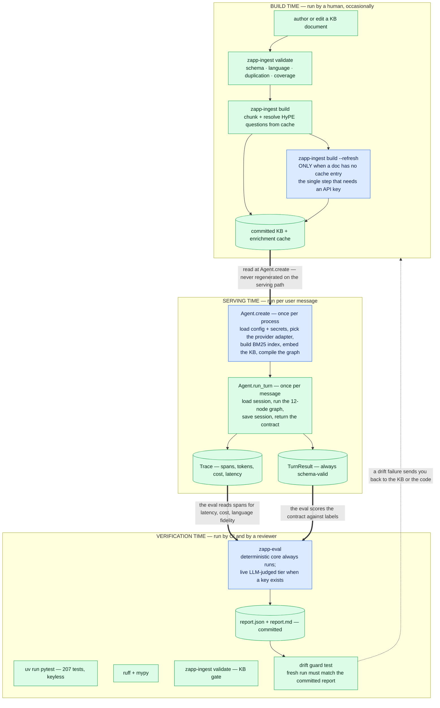
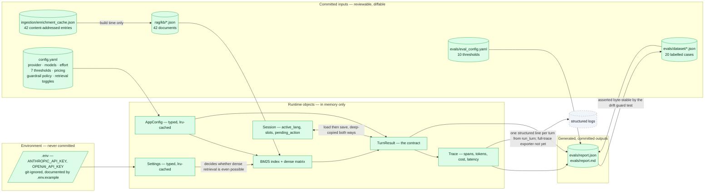
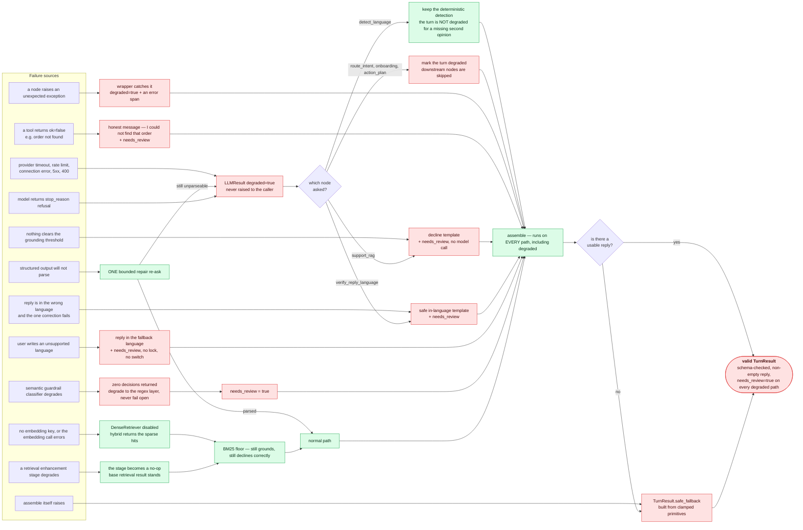
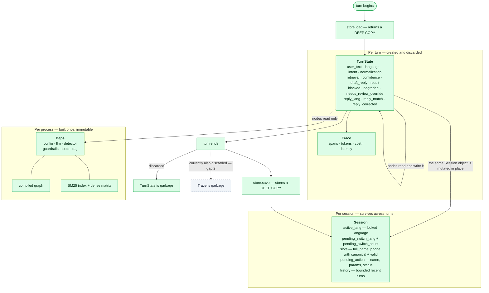
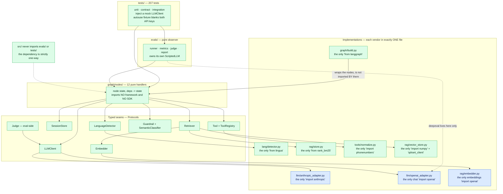

# Zapp Assist — System Flow

How the whole system fits together, end to end. [architecture.md](architecture.md) goes *down* into
each of the six layers and argues the trade-offs; this document goes *across* them — what runs when,
what data moves between the parts, what happens when something breaks, and which module is allowed to
import what.

Six views, each answering one question:

| # | View | Question it answers |
|---|---|---|
| 1 | [Three time domains](#1-three-time-domains) | What runs at build time, at serving time, and at verification time? |
| 2 | [One request, every component](#2-one-request-every-component) | What exactly happens between a user message and a returned contract? |
| 3 | [Artifact flow](#3-artifact-flow) | Which files exist, who writes them, who reads them? |
| 4 | [The degradation map](#4-the-degradation-map) | Every way this can fail, and where each failure lands |
| 5 | [State lifetimes](#5-state-lifetimes) | What survives a turn, what survives a session, what is thrown away |
| 6 | [The seam map](#6-the-seam-map) | Which module may import which dependency, and why it matters |

Colours are the same throughout the docs: **green** = deterministic/offline, **blue** = spends an LLM
call, **red** = fail-safe path, **dashed grey** = not implemented.

---

## 1. Three time domains

The system runs in three distinct phases that never overlap. The only things crossing between them
are committed files — which is what makes each phase independently reproducible.



**The rule this encodes:** anything expensive, non-deterministic, or key-dependent is pushed left,
into build time, where it is paid once and committed. The serving path inherits the *result* of that
work, not the work. Verification runs entirely on committed artifacts, with no network.

`Agent.create` is blue because it embeds the knowledge base when a key is present — the one place
serving-time setup spends money. `zapp-eval` is blue only for its optional live tier.

---

## 2. One request, every component

A single support question, from CLI to contract. Every arrow is real control flow.

```mermaid
sequenceDiagram
    autonumber
    actor U as User
    participant C as CLI
    participant A as Agent
    participant St as SessionStore
    participant G as Graph
    participant N as Nodes
    participant L as LLM adapter
    participant R as Retriever
    participant T as Trace

    Note over C,R: Agent.create — once per process
    C->>A: Agent.create
    A->>A: load config.yaml and .env, both lru-cached
    A->>L: build the adapter selected by config.provider
    A->>R: BM25 index over 42 docs, embed 210 representations if a key exists
    A->>G: build_graph deps — the only LangGraph call in the codebase

    Note over U,T: run_turn — once per message
    U->>C: hasta cuando puedo reprogramar mi entrega
    C->>A: run_turn session_id, text
    A->>St: load session_id
    St-->>A: deep copy of Session — active_lang, slots, pending_action
    A->>T: new Trace with a fresh turn_id
    A->>G: invoke with the whole TurnState in one channel

    G->>N: guardrail_in
    N->>T: span — 4 regex rules, no rule fired
    G->>N: detect_language
    N->>L: language second opinion
    L-->>N: LangSignal es 0.96
    N->>N: lingua wins, LLM only adjusts confidence, lock active_lang
    N->>T: span + token usage and cost
    G->>N: route_intent
    N->>L: intent classification
    L-->>N: support 0.95
    N->>T: span
    G->>N: support_rag
    N->>R: search
    R->>R: BM25 union dense, RRF-fused, trimmed to top_k
    R-->>N: ranked documents with scores
    N->>L: answer strictly from these snippets
    L-->>N: GroundedAnswer with a grounded flag
    N->>T: span — grounded, hits, top_score
    G->>N: verify_reply_language
    N->>N: lingua on the reply — matches, no LLM spent
    N->>T: span — reply_match true
    G->>N: verify_confidence
    N->>T: span — combined score vs threshold
    G->>N: guardrail_out
    N->>T: span — 3 output rules, none fired
    G->>N: assemble
    N->>N: build and validate TurnResult, or substitute safe_fallback
    N->>T: span
    G-->>A: final state

    A->>T: set total_latency_ms
    A->>St: save the mutated Session
    A-->>C: TurnResult
    C-->>U: reply, in Spanish
    Note over A,T: a structured summary line is logged; the full Trace is not returned — see gap 2
```

Three details in that sequence are load-bearing:

- **The session is exchanged as a deep copy** in both directions, so a turn that crashes mid-flight
  leaves the stored session exactly as it was.
- **`assemble` runs last and unconditionally.** Whatever happened upstream, the final step either
  validates a contract or substitutes one that cannot fail validation.
- **A per-turn summary is logged; the full trace is not exported.** Step-by-step capture works and a
  structured line is emitted from `run_turn`; the complete span tree is not yet returned or exported.

---

## 3. Artifact flow

Every file the system reads or writes, and the direction it moves.



Two properties worth stating: **no secret ever reaches a committed file** (the only path out of
`.env` is into an in-memory `Settings`), and **every committed output is regenerable from committed
inputs** with no network — which is exactly what the drift-guard test asserts.

---

## 4. The degradation map

Every failure mode in the system, and where each one lands. This is the single most important
property of the design: **every arrow terminates in a valid contract.**



Read it as a claim you can falsify: **there is no path from any box on the left to a crash, a hang, a
partial object, or a schema-invalid response.** The cost of that guarantee is a bias toward
over-flagging — the system would rather escalate a good turn to a human than quietly return a bad
one, which is the correct direction for a support agent.

Note the one asymmetry: a degraded *language second opinion* does **not** degrade the turn. The
deterministic detector is authoritative anyway, so losing the cross-check costs confidence, not
correctness.

---

## 5. State lifetimes

Three kinds of state with three different lifetimes. Confusing them is how agent systems leak.



The deep copy on both `load` and `save` is what makes the store swappable: nothing in a node holds a
reference into stored state, so replacing the in-memory dict with Redis changes no node. It is also
what makes a crashed turn harmless — the stored session was never touched.

The one thing that *should* outlive the turn and does not is the `Trace`. Everything else has the
lifetime it should.

---

## 6. The seam map

Which module may import what. Arrows point in the only permitted direction; every vendor library is
confined to exactly one file, verified by grep.



This map is the reason the project survived a mid-build provider change. When the Anthropic account
ran out of credits, `config.yaml` flipped `provider: anthropic` to `openai` and one adapter file was
added — no node, no test, and no graph edge changed. A seam is only worth its cost if it is ever
actually used; this one was.

**Verified, not asserted:**

```bash
grep -rn "^\s*import anthropic\|^\s*from anthropic" src/   # → 1 file
grep -rn "^\s*from langgraph" src/                          # → 1 file
grep -rn "^\s*from lingua" src/                             # → 1 file
grep -rn "^\s*from rank_bm25" src/                          # → 1 file
grep -rn "import evals\|from evals" src/                    # → nothing
```

These belong in CI next to the tests — a seam decays the moment something reaches through it, and
nothing currently stops that.

---

## Where to go next

- **[architecture.md](architecture.md)** — the same system layer by layer, with the decisions, the
  rejected alternatives, the costs accepted, and the [ranked list of known gaps](architecture.md#known-gaps-ranked).
- **[docs/README.md](README.md)** — the six-layer summary table and the keyless verification commands.
- **[specs/](../specs/)** — the spec → plan → tasks → research artifacts each feature was built from.
